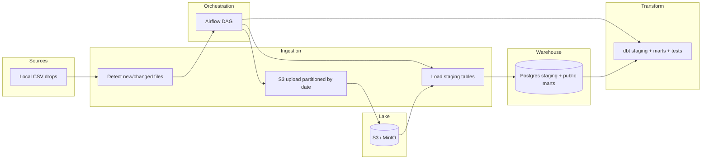

# Wearable data pipeline

Production-style local reference stack: **CSV drops → S3-compatible lake (MinIO) → Postgres staging → dbt → quality checks & marts**. Apache Airflow orchestrates the happy path; everything except real AWS S3 is runnable on a laptop (MinIO substitutes for S3).

---

## Architecture



**Data flow (logical):**

1. **Drop files** — Classified CSVs under `DATA_DROP_DIR` (default `./sample_data`). Activity filenames must contain both `daily` and `activity`; sleep files must contain `sleep`.
2. **Detect** — Compares local SHA-256 checksums to `ops.s3_upload_manifest` and (optionally) object metadata on the lake to avoid redundant uploads.
3. **Upload** — Writes objects to `s3://$S3_BUCKET/$S3_PREFIX/{activity|sleep}/date=YYYY-MM-DD/<file>.csv` with `sha256` in S3 object metadata. Postgres records uploads in `ops.s3_upload_manifest`.
4. **Load** — Lists hive-style prefixes, downloads all activity/sleep CSVs, truncates/reloads `staging.daily_activity` and `staging.sleep`.
5. **Transform** — dbt reads the `staging` source, builds views in the staging layer (`stg_*`), materializes marts as tables in `public`, and runs tests (`not_null`, `unique`, `accepted_range` / `accepted_values`).
6. **Volume anomaly mart** — `mart_data_volume_anomaly` flags calendar days where `stg_daily_activity` row counts deviate more than **30%** from a trailing **7-day** average (no flag when no history).

---

## Repository layout

| Path | Purpose |
|------|---------|
| `dags/` | Airflow DAGs (`wearable_pipeline_dag.py`) |
| `ingestion/` | Python ingest utilities, S3 I/O, manifests, CLI modules |
| `dbt/` | Models, tests, macros, profile template |
| `docker/` | `docker-compose.yml` (Postgres, MinIO, Airflow) + `airflow/Dockerfile` |
| `infra/` | `.env.example` template (copy to repo root `.env`) |
| `sample_data/` | Example activity + sleep CSVs |
| `Makefile` | Common commands |

---

## Configuration

Copy **`infra/.env.example`** to **`.env`** at the repo root and adjust values. Core variables:

| Variable | Purpose |
|----------|---------|
| `DATABASE_URL` or `DB_*` | Warehouse Postgres connection |
| `DATA_DROP_DIR` | Directory scanned for CSV drops |
| `S3_ENDPOINT_URL` | Omitted for AWS; `http://localhost:9000` for MinIO from the host; `http://minio:9000` inside Docker |
| `S3_BUCKET`, `S3_PREFIX` | Lake bucket and key prefix (default `wearable-lake`, `raw`) |
| `AWS_ACCESS_KEY_ID`, `AWS_SECRET_ACCESS_KEY` | MinIO defaults `minioadmin` / `minioadmin` locally |
| `LOG_LEVEL` | Python log level for CLI modules |
| `AIRFLOW_UID` | Linux user id for Airflow containers (default `50000`) |
| `AIRFLOW__CORE__FERNET_KEY` | Override the dev default in `docker/docker-compose.yml` for non-dev use |

Logging uses a consistent format across ingestion CLIs: `timestamp | LEVEL | logger | message`.

**Idempotency**

- **Postgres file manifest** (`ops.raw_ingest_manifest`): skips unchanged local→Postgres loads when using `ingestion.ingest --use-manifest`.
- **S3 upload manifest** (`ops.s3_upload_manifest` + object metadata `sha256`): skips unchanged uploads when checksums match.

---

## Quick start (Docker stack + Airflow)

Prerequisites: Docker with Compose v2 (`include` support), and **make** (optional).

```bash
# From repo root — starts warehouse Postgres, MinIO, Airflow metadata DB, web UI, scheduler
docker compose up -d
```

- **Postgres (warehouse):** `localhost:5432` / user `wearable` / password `wearable` / DB `wearable`
- **MinIO API:** `http://localhost:9000`
- **MinIO console:** `http://localhost:9001` (`minioadmin` / `minioadmin`)
- **Airflow UI:** `http://localhost:8080` (default admin user is created in `airflow-init`: username **`admin`**, password **`admin`**)

Open the UI → enable/unpause **`wearable_pipeline`** → trigger a run. The DAG runs:

`detect_new_files` → `upload_to_s3` → `load_staging_postgres` → `dbt_run` → `dbt_test`.

---

## Quick start (host Python, no Airflow)

```bash
python -m venv .venv
# activate venv per your OS
pip install -r requirements.txt
cp infra/.env.example .env   # edit S3_ENDPOINT_URL for MinIO if needed

# Terminal 1 — minimal services without Airflow (see Makefile)
docker compose up -d postgres minio minio-init

# Terminal 2 — warehouse must be empty or compatible; load lake then staging then dbt
python -m ingestion.upload_to_s3
python -m ingestion.load_s3_to_staging

mkdir -p ~/.dbt && cp dbt/profiles.yml ~/.dbt/profiles.yml
cd dbt && dbt run && dbt test
```

**Direct local load (bypass S3)** — useful for unit/integration tests:

```bash
python -m ingestion.ingest --data-dir sample_data --use-manifest
cd dbt && dbt run && dbt test
```

**Legacy runner** (ingest + dbt with JSON step logs):

```bash
make run-prod
# or:  PIPELINE_DATA_DIR=sample_data PIPELINE_USE_MANIFEST=1 python -m ingestion.runner
```

---

## Make targets

| Target | Description |
|--------|-------------|
| `make up` | Postgres + MinIO (+ bucket init job) |
| `make up-all` | Full stack including Airflow |
| `make down` | Stop compose project |
| `make upload` / `make load` | Run lake upload / staging reload on the host |
| `make smoke` | `upload` + `load` + `dbt run` + `dbt test` (requires host access to Postgres + MinIO) |
| `make test` | `pytest` |

---

## dbt layers

- **Sources:** `staging.daily_activity`, `staging.sleep`
- **Staging models:** `stg_daily_activity`, `stg_sleep` (typed, cleaned columns)
- **Marts:** existing user activity / baseline / deviation tables; **`mart_daily_health_metrics`** (steps, distances, calories, **`sleep_efficiency_ratio`**); **`mart_data_volume_anomaly`** (row count vs trailing average)

Tests live in `dbt/models/**/schema.yml` and custom macros (e.g. `accepted_range`).

---

## Dashboard (optional)

After `dbt run`:

```bash
streamlit run dashboards/app.py
```

---

## S3 layout

Objects are partitioned by calendar date inferred from each file’s rows (minimum activity/sleep date in the CSV):

- `s3://<bucket>/<prefix>/activity/date=YYYY-MM-DD/<filename>.csv`
- `s3://<bucket>/<prefix>/sleep/date=YYYY-MM-DD/<filename>.csv`

---

## Troubleshooting

- **`docker compose` include errors** — Upgrade Compose, or run `docker compose -f docker/docker-compose.yml up -d` explicitly.
- **Airflow DAG import errors** — Ensure `PYTHONPATH` includes the repo root (set in `docker/docker-compose.yml`).
- **MinIO connection from the host** — Use `S3_ENDPOINT_URL=http://127.0.0.1:9000` in `.env`; from containers use `http://minio:9000`.
- **Empty staging / dbt source not found** — Run upload and load (or `ingestion.ingest`) before `dbt run`.

---

## CI

GitHub Actions runs ingestion against Postgres, **pytest**, and **dbt run/test** on push/PR using `sample_data` and the default `staging` schema.
