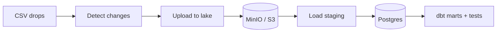

# Wearable data pipeline

A local, production-style reference pipeline for wearable health CSVs (daily activity and sleep). It ingests files from a drop folder, lands them in an S3-compatible lake, loads Postgres staging tables, and builds tested dbt marts for analytics.

The stack mirrors a small lakehouse pattern: **CSV → lake (MinIO) → warehouse (Postgres) → dbt transforms → quality checks**. Apache Airflow can orchestrate the full path; you can also run each step from the host with Make or Python CLIs. MinIO stands in for AWS S3 so everything runs on a laptop.

**What you get out of it**

- Staging tables for raw activity and sleep data
- dbt marts for per-user daily activity, baselines, deviations, and combined health metrics
- Data quality tests (`not_null`, `unique`, range checks)
- Optional Streamlit dashboard for baseline trend exploration

Sample data is included in `sample_data/`.

---

## How it works


```mermaid
flowchart LR
  CSV[CSV drops] --> DET[Detect changes]
  DET --> UP[Upload to lake]
  UP --> S3[(MinIO / S3)]
  S3 --> LD[Load staging]
  LD --> PG[(Postgres)]
  PG --> DBT[dbt marts + tests]
```

1. **Drop** — Place CSVs in `DATA_DROP_DIR` (default `sample_data/`). Activity files need `daily` and `activity` in the name; sleep files need `sleep`.
2. **Upload** — Partitioned objects land in the lake (`activity/` and `sleep/` by date). Checksums skip unchanged files.
3. **Load** — Staging tables `staging.daily_activity` and `staging.sleep` are reloaded from the lake.
4. **Transform** — dbt builds `stg_*` views and mart tables in `public`, then runs tests.

With Airflow (`make up-all`), the `wearable_pipeline` DAG runs detect → upload → load → dbt run → dbt test.

---

## Project structure

| Path | Purpose |
|------|---------|
| `ingestion/` | Python CLIs — detect, upload, load, direct ingest |
| `dbt/` | SQL models, tests, and macros |
| `dags/` | Airflow DAG definition |
| `docker/` | Compose stack (Postgres, MinIO, Airflow) |
| `sample_data/` | Example CSVs |
| `dashboards/` | Streamlit app |
| `infra/.env.example` | Environment template — copy to `.env` at repo root |
| `Makefile` | Common local commands |

---

## Quick start

**Prerequisites:** Docker (Compose v2), Python 3.11+

```bash
cp infra/.env.example .env
pip install -r requirements.txt
make up      # Postgres + MinIO
make smoke   # upload → load → dbt run → dbt test
```

**Default services**

| Service | Connection |
|---------|------------|
| Postgres | `localhost:5432`, db `wearable`, user/pass `wearable` |
| MinIO API | `http://localhost:9000` |
| MinIO console | `http://localhost:9001` (`minioadmin` / `minioadmin`) |

---

## Running the pipeline

### End-to-end (recommended)

```bash
make smoke
```

Runs upload, staging load, `dbt run`, and `dbt test` against the running Docker services.

### With Airflow

```bash
make up-all          # or: docker compose up -d
```

Open `http://localhost:8080` (admin / admin), enable **`wearable_pipeline`**, and trigger a run.

### Without S3 (quick local path)

Useful for tests or when you only need Postgres + dbt:

```bash
make up
python -m ingestion.ingest --data-dir sample_data --use-manifest
cd dbt && dbt run && dbt test
```

Or use the pipeline runner (ingest + dbt with JSON step logs): `make run-prod`

### Dashboard

After marts are built:

```bash
make dashboard
```

---

## Configuration

Copy `infra/.env.example` to `.env`. The essentials:

| Variable | Default | Purpose |
|----------|---------|---------|
| `DATA_DROP_DIR` | `./sample_data` | Folder scanned for CSV drops |
| `S3_ENDPOINT_URL` | `http://localhost:9000` | MinIO from the host (`http://minio:9000` inside Docker) |
| `DB_HOST` / `DB_*` | `localhost:5432` | Warehouse Postgres |
| `DATABASE_URL` | — | Alternative to `DB_*` (also used by dbt) |

See [docs/optional.md](docs/optional.md) for the full variable list, S3 key layout, idempotency manifests, and troubleshooting.

---

## Make targets

| Target | Description |
|--------|-------------|
| `make up` | Postgres + MinIO |
| `make up-all` | Full stack including Airflow |
| `make down` | Stop containers |
| `make upload` / `make load` | Lake upload or staging reload only |
| `make smoke` | Full pipeline on the host |
| `make run-prod` | Ingest + dbt via `ingestion.runner` |
| `make test` | `pytest` |
| `make dashboard` | Streamlit UI |
| `make help` | All targets |

---

## More

- **[Optional & advanced](docs/optional.md)** — dbt layer details, S3 layout, CI, troubleshooting
- **[Deploy & cloud](docs/deploy.md)** — cloud Postgres, scheduled runs, containers
- **[Design decisions](docs/design-decisions.md)** — architecture rationale
